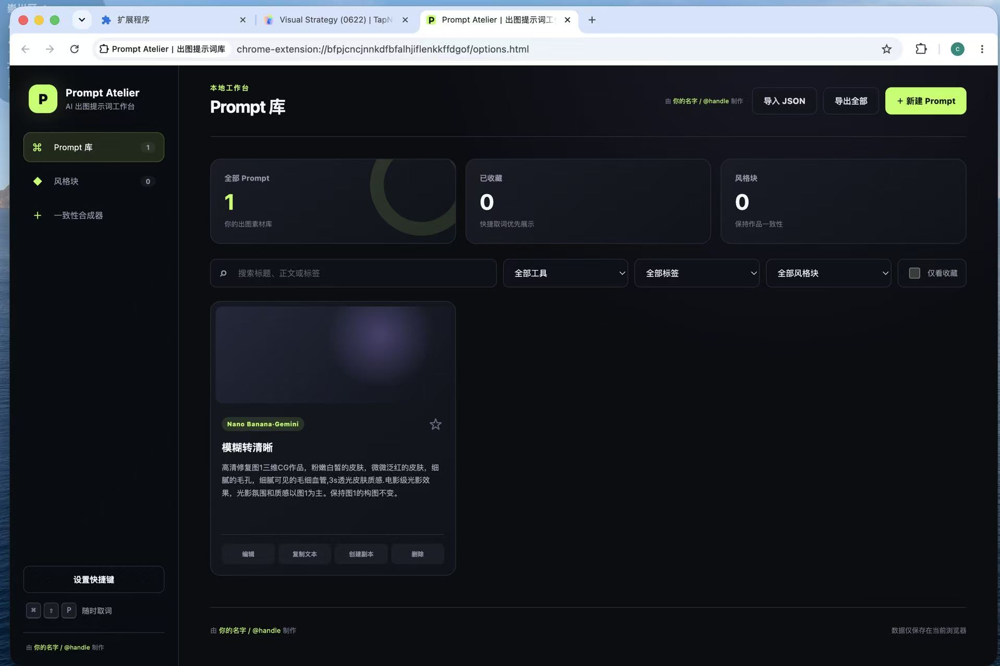
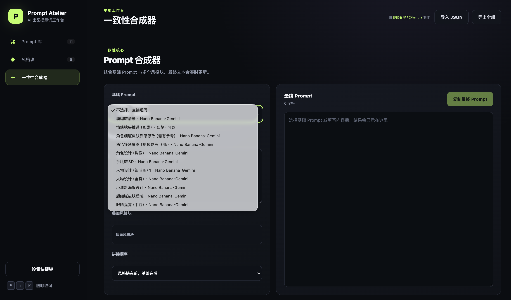

# Prompt Atelier｜出图提示词库

<p align="center">
  <strong>AI 出图 Prompt 管理与快捷取词浏览器扩展</strong><br>
  <strong>Browser Extension for AI Image Prompt Management & Quick Insertion</strong>
</p>

<p align="center">
  <a href="#中文说明">中文</a> · <a href="#english-readme">English</a>
</p>

---

## 中文说明

### 简介

Prompt Atelier 是一个专为 AI 出图设计师制作的本地 Prompt 管理与快捷取词浏览器扩展。它能集中管理你的出图提示词、工具参数、参考图和品牌风格块，并在任意网页的输入框中快速插入最终 Prompt。

全部数据只保存在浏览器本机，**不需要后端、不需要账号、不需要第三方服务**。

### 功能特性

- **多工具支持**：Midjourney、Stable Diffusion 系、Nano Banana·Gemini、即梦·可灵、其他自定义工具。
- **完整 Prompt 管理**：标题、正文、标签、收藏、备注、参考图、结果缩略图。
- **工具专属参数**：Midjourney 的 `--v` / `--niji` / `--ar` / `--stylize` 等；SD 的模型、采样器、LoRA、负向 Prompt 等；即梦的风格与比例等。
- **风格块与品牌预设**：将配色、光线、材质与禁用项整理成可复用片段，支持品牌预设置顶。
- **一致性合成器**：组合基础 Prompt 与多个风格块，实时预览最终文本。
- **快捷取词器**：在任意网页输入框中，通过快捷键或输入 `/p` 快速弹出取词浮层，支持键盘导航、实时搜索、风格叠加。
- **智能插入**：优先直接插入标准输入框、文本框和富文本编辑器；非标准控件自动复制到剪贴板并提示粘贴。
- **JSON 导入导出**：全量备份与合并导入，带版本校验，不会覆盖已有数据。
- **数据本地化**：所有内容保存在 `chrome.storage.local`，不上传任何服务器。

### 安装

1. 打开 Chrome 的 `chrome://extensions` 或 Edge 的 `edge://extensions`。
2. 开启右上角「开发者模式」。
3. 点击「加载已解压的扩展程序」。
4. 选择本项目根目录（包含 `manifest.json` 的文件夹）。
5. 扩展图标会出现在浏览器工具栏，点击即可打开管理页。

### 使用方法

#### 管理页（整理提示词）

点击浏览器工具栏上的扩展图标，进入管理页面：

- **Prompt 库**：新建、编辑、复制、收藏、删除 Prompt。支持按工具、标签、风格块和收藏筛选。
- **风格块**：创建复用片段（如品牌配色、光线风格），勾选「品牌预设」可优先置顶。
- **一致性合成器**：选择基础 Prompt + 勾选风格块 → 实时合成最终文本 → 一键复制。

#### 快捷取词器（在网页中使用）

在任意有输入框的网页（如 ChatGPT、Midjourney、即梦、可灵等）：

**方式一：快捷键**
- Windows / Linux：`Ctrl + Shift + P`
- macOS：`Command + Shift + P`

**方式二：斜杠命令**
- 在输入框中输入 `/p`，自动触发取词器。

**操作**：
- 用 `↑` `↓` 选择 Prompt，按 `Enter` 插入。
- 右侧勾选风格块可叠加使用。
- 点击「插入到输入框」直接写入；若当前控件不支持插入，自动复制到剪贴板并提示 `Ctrl + V` 粘贴。

### 快捷键

| 功能 | Windows/Linux | macOS |
|------|---------------|-------|
| 打开快捷取词器 | `Ctrl + Shift + P` | `Command + Shift + P` |

可在浏览器扩展管理页的「快捷键」设置中自定义。

### 修改产品信息

编辑项目根目录的 `config.js`，修改 `PROMPT_ATELIER_CONFIG` 对象即可：

```javascript
globalThis.PROMPT_ATELIER_CONFIG = Object.freeze({
  productName: "Prompt Atelier",
  productSubtitle: "AI 出图提示词工作台",
  makerName: "zuzu",
  makerUrl: "https://example.com",
  attributionPrefix: "由",
  attributionSuffix: "制作"
});
```

### 截图

| Prompt 库 | 一致性合成器 |
|-----------|-------------|
|  |  |

### 开发

```bash
# 语法检查
npm run check

# 运行测试
npm test
```

测试文件位于 `tests/` 目录。

### 技术栈

- 原生 HTML、CSS、JavaScript
- Chrome Extension Manifest V3
- `chrome.storage.local` + `unlimitedStorage` 本地数据持久化
- Shadow DOM 隔离取词器样式
- 无构建步骤、无运行时依赖

### 文件结构

```
.
├── manifest.json           # Manifest V3 配置
├── service-worker.js       # 后台脚本：初始化数据、快捷键转发
├── content.js              # 内容脚本：取词器注入、插入逻辑
├── options.html            # 管理页 HTML
├── options.css             # 管理页样式
├── options.js              # 管理页逻辑
├── config.js               # 产品名、署名配置
├── shared/
│   ├── core.js             # 数据结构、筛选、合成、导入校验
│   └── storage.js          # 统一存储读写
├── assets/                 # 扩展图标
└── tests/                  # 单元测试与验收页
```

### 许可证

[MIT](LICENSE)

---

## English README

### Introduction

Prompt Atelier is a local browser extension for managing AI image-generation prompts. It lets you organize prompts, tool parameters, reference images, and brand style blocks in one place, then quickly insert the final prompt into any webpage input field.

All data is stored **locally in your browser**. No backend, no account, no third-party service required.

### Features

- **Multi-tool support**: Midjourney, Stable Diffusion, Nano Banana·Gemini, 即梦·可灵 (Jimeng/Keling), and custom tools.
- **Full prompt management**: Title, body, tags, favorites, notes, reference images, and result thumbnails.
- **Tool-specific parameters**: e.g. `--v` / `--niji` / `--ar` / `--stylize` for Midjourney; model, sampler, LoRA, negative prompt for SD; style and aspect ratio for 即梦.
- **Style blocks & brand presets**: Reusable fragments for color schemes, lighting, materials, and exclusions. Brand presets can be pinned to the top.
- **Consistency composer**: Combine a base prompt with multiple style blocks, preview the final text in real time.
- **Quick picker**: Open a floating picker on any webpage via hotkey or by typing `/p` in an input field. Supports keyboard navigation, live search, and style stacking.
- **Smart insertion**: Prioritizes direct insertion into standard inputs, textareas, and rich-text editors. Falls back to clipboard copy with a toast notification for non-standard controls.
- **JSON import/export**: Full backup and merge import with version validation. Existing data is never overwritten.
- **Local-only storage**: Everything lives in `chrome.storage.local`. Nothing is uploaded to any server.

### Installation

1. Open Chrome (`chrome://extensions`) or Edge (`edge://extensions`).
2. Enable **Developer mode** (toggle in the top right).
3. Click **Load unpacked**.
4. Select the project root folder (the one containing `manifest.json`).
5. The extension icon will appear in your browser toolbar. Click it to open the management page.

### Usage

#### Management Page (Organize Prompts)

Click the extension icon in the browser toolbar to open the management page:

- **Prompt Library**: Create, edit, copy, favorite, and delete prompts. Filter by tool, tag, style block, and favorites.
- **Style Blocks**: Create reusable fragments (e.g., brand color schemes, lighting styles). Mark as "brand preset" to pin them to the top.
- **Consistency Composer**: Select a base prompt + check style blocks → real-time preview of final text → one-click copy.

#### Quick Picker (Use on Any Webpage)

On any webpage with an input field (e.g., ChatGPT, Midjourney, 即梦, Keling):

**Method 1: Hotkey**
- Windows / Linux: `Ctrl + Shift + P`
- macOS: `Command + Shift + P`

**Method 2: Slash command**
- Type `/p` in any input field to trigger the picker automatically.

**Controls:**
- Use `↑` `↓` to select a prompt, press `Enter` to insert.
- Check style blocks on the right to stack them.
- Click "Insert" to write directly into the input. If the current control doesn't support insertion, it automatically copies to the clipboard and shows a toast prompting `Ctrl + V` to paste.

### Keyboard Shortcuts

| Action | Windows/Linux | macOS |
|--------|---------------|-------|
| Open Quick Picker | `Ctrl + Shift + P` | `Command + Shift + P` |

You can customize shortcuts in the browser's extension management page.

### Customization

Edit `config.js` in the project root to change product info:

```javascript
globalThis.PROMPT_ATELIER_CONFIG = Object.freeze({
  productName: "Prompt Atelier",
  productSubtitle: "AI Image Prompt Workbench",
  makerName: "zuzu",
  makerUrl: "https://example.com",
  attributionPrefix: "Made by",
  attributionSuffix: ""
});
```

### Screenshots

| Prompt Library | Consistency Composer |
|----------------|----------------------|
|  |  |

### Development

```bash
# Syntax check
npm run check

# Run tests
npm test
```

Test files are in `tests/`.

### Tech Stack

- Vanilla HTML, CSS, JavaScript
- Chrome Extension Manifest V3
- `chrome.storage.local` + `unlimitedStorage` for local persistence
- Shadow DOM for picker style isolation
- Zero build steps, zero runtime dependencies

### Project Structure

```
.
├── manifest.json           # Manifest V3 config
├── service-worker.js       # Background: init data, hotkey forwarding
├── content.js              # Content script: picker injection, insertion logic
├── options.html            # Management page HTML
├── options.css             # Management page styles
├── options.js              # Management page logic
├── config.js               # Product name & attribution config
├── shared/
│   ├── core.js             # Data structures, filtering, composition, import validation
│   └── storage.js          # Unified storage read/write
├── assets/                 # Extension icons
└── tests/                  # Unit tests & acceptance pages
```

### License

[MIT](LICENSE)

---

<p align="center">
  Made with ❤️ by zuzu
</p>

<p align="center">
  数据仅保存在本机 · Data stays local only
</p>
